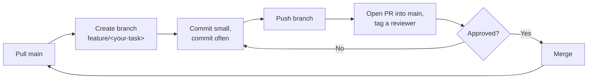

# kv-cache-nlp
Patch-aware KV cache compression for byte-level LMs (BLT-style). CS F429 group project.

## Data contract
TBD — first thing to lock before splitting up model work.

## Part 2 — due Oct 15
- [ ] Data pipeline: TinyStories + WikiText-103 download/preprocess, dedup, splits, stats — @
- [ ] Classical baseline: byte-level n-gram (Kneser-Ney) — @
- [ ] Modern baseline: BPE Transformer (10-30M params) — @
- [ ] BPB harness comparing both — @
- [ ] Error analysis (quant + qualitative) — @
- [ ] CLI demo (train + show results) — @
- [ ] Report sections a-d — @
- [ ] Demo rehearsal — @

## Part 3 — due Nov 21
- [ ] Byte-level BLT baseline (local encoder, global transformer, local decoder, entropy patcher) — @
- [ ] Entropy-guided KV cache compression — @
- [ ] StreamingLLM and random eviction controls at same budget — @
- [ ] Needle-in-haystack retrieval check — @
- [ ] Code vs prose comparison — @
- [ ] Full report + final demo — @

## How we work

Setup
- [ ] Clone the repo
- [ ] pip install -r requirements.txt
- [ ] Claim a task above — put your name/handle next to it

Workflow (repeat per task)

- [ ] Pull main before starting: git pull
- [ ] Create a branch: git checkout -b feature/<your-task>
- [ ] Commit small, commit often
- [ ] Push your branch: git push origin feature/<your-task>
- [ ] Open a PR into main, tag someone to review
- [ ] Get it reviewed, then merge
- [ ] Pull main again before continuing your next task

Rules
- [ ] Never push directly to main
- [ ] Don't sit on a branch for days without pushing
- [ ] Ping the group in chat if blocked, don't grind silently
