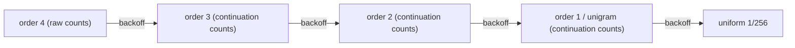
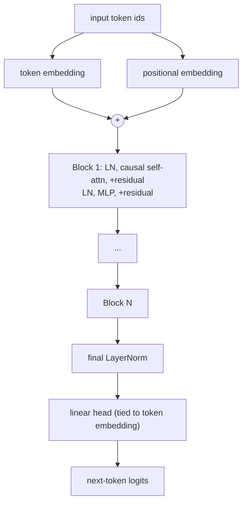
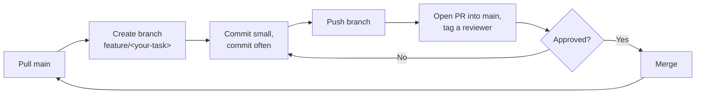

# kv-cache-nlp
Patch-aware KV cache compression for byte-level LMs (BLT-style). CS F429 group project.

## The idea

Normal LLMs tokenize text into subwords before feeding it to a transformer. That means a fixed
vocabulary, out-of-vocabulary handling, and vocabulary bias across languages and domains.
Byte-level models skip tokenization entirely — the vocabulary is just the 256 byte values, so
anything is representable.

The tradeoff is length: a byte sequence is roughly 4x longer than the token sequence for the
same text, and a transformer's KV cache grows with sequence length. So byte-level models end up
paying for their simplicity with a much bigger KV cache at inference time. That's the problem
[Meta's BLT paper](https://arxiv.org/abs/2412.09871) tackles, and it's what this project is
about too.

Part 2 (due Oct 15) is the groundwork: build a data pipeline and two baselines — a classical
n-gram model and a modern transformer — so we have something to compare against and a working
harness before touching the actual research question.

Part 3 (due Nov 21) is the real thing: build a BLT-style byte-level model (local encoder, global
transformer, local decoder, entropy-based patcher) and test whether entropy-guided KV cache
compression beats naive baselines like a fixed sliding window or random eviction, at the same
memory budget.

## Setup

```bash
git clone <repo>
cd kv-cache-nlp
pip install -r requirements.txt
```

`pip install torch` alone gives you a CPU-only build. If you have an NVIDIA GPU, check
`nvidia-smi` for your driver's max CUDA version, then install the matching build instead —
cu126 works for most current drivers:

```bash
pip install torch --index-url https://download.pytorch.org/whl/cu126
```

## Layout

```
kv-cache-nlp/
├── data/
│   ├── raw/               HF datasets cache (gitignored)
│   └── processed/          cleaned JSONL + stats (gitignored, rebuild with prepare_data.py)
├── models/                 model code only — no CLI or training logic
│   ├── ngram.py            KneserNeyByteLM
│   └── transformer.py      GPT (decoder-only transformer)
├── scripts/
│   ├── data_utils.py       shared JSONL reader, checkpoint loaders, safe_print
│   ├── prepare_data.py     download, clean, dedup, split
│   ├── train_ngram.py
│   ├── train_bpe_transformer.py
│   ├── bpb_harness.py      comparison table across both baselines
│   ├── error_analysis.py   per-document quant + qualitative analysis
│   └── demo.py             interactive CLI demo
├── checkpoints/            trained models + results.json (gitignored)
│   └── demo/               live-demo training runs — kept away from the real results
└── eval/                   generated reports (tracked in git)
```

## Data: what we used and why

Two datasets, picked to be genuinely different in difficulty rather than two similar ones.

**TinyStories** (`roneneldan/TinyStories`) — GPT-generated children's stories, small vocabulary,
short and repetitive ("Once upon a time, there was a ___ named ___..."). Our processed set:
30,000 train docs, averaging 890 bytes each. It's fast to download and fast to train on, and
because it's so repetitive, a broken baseline shows up almost immediately. We used it as the
main dataset for validating every stage of the pipeline before trusting anything on WikiText.

**WikiText-103** (`Salesforce/wikitext`, `wikitext-103-raw-v1`) — real Wikipedia Featured/Good
articles, long-form and diverse. Our processed set: 29,002 train docs, averaging about 18KB
each — roughly 20x longer per document than TinyStories. It also has real non-ASCII text
(accented characters, em dashes, occasional Greek and CJK) that TinyStories never produces.
Long documents stress a fixed-context-window model and forced the chunked evaluation logic
described below; the non-ASCII text surfaced a couple of real encoding bugs during testing.

We didn't seriously consider raw Wikipedia dumps, C4, or OpenWebText — too large for the
compute and time budget of a course project, and WikiText-103 already gives most of that
difficulty pre-cleaned. Project Gutenberg was an option but adds licensing and header-stripping
overhead that wasn't worth it given WikiText covers the "long real text" case already. Code
corpora are deliberately left for Part 3's code-vs-prose comparison.

## Running it, in order

```bash
python scripts/prepare_data.py --dataset all --out data/processed
```
Downloads both datasets via HuggingFace, cleans and deduplicates them, and writes
`data/processed/<dataset>/<split>.jsonl` (one doc per line, `{"id": ..., "text": ...}`) plus a
`stats.json` per dataset. WikiText's raw export isn't actually raw — it's line-by-line text with
`= Title =` headers marking article boundaries and leftover `@-@`/`@,@`/`@.@` placeholders from
whatever extraction tool Salesforce used originally (standing in for hyphens, commas, periods).
Both get handled here: articles are reconstructed from the headers, and the placeholders are
stripped back to the real punctuation. Streams from HuggingFace when a doc cap is set, so a
quick "check the first 500 docs" run doesn't pay the cost of loading the full ~500MB+ split.

```bash
python scripts/train_ngram.py --dataset tinystories --order 4 --max-train-docs 25000 --eval-max-docs 2000
python scripts/train_ngram.py --dataset wikitext103 --order 4 --max-train-docs 4500 --eval-max-docs 60
```
Classical baseline: an order-4 byte-level n-gram model with interpolated Kneser-Ney smoothing
(Kneser & Ney 1995, Chen & Goodman's interpolated formulation). Works directly on raw bytes, no
tokenizer, vocabulary of 256. Kneser-Ney backs off from the full 4-byte context down through
shorter contexts to a uniform distribution, using continuation counts (how many distinct
contexts a byte follows) rather than raw frequency at every level except the top order — the
usual fix for n-gram models over-trusting rare sequences.



WikiText gets fewer docs than TinyStories here on purpose. This is pure-Python exact counting,
and its cost scales with total bytes, not doc count — WikiText documents average about 20x more
bytes each, so 4,500 of them is already a comparable byte volume to 25,000 TinyStories docs. We
measured this directly (1,000 real WikiText docs took 38.5 seconds to count) before picking
these numbers, rather than guessing.

```bash
python scripts/train_bpe_transformer.py --dataset tinystories --max-steps 3000 --device cuda
python scripts/train_bpe_transformer.py --dataset wikitext103 --max-steps 3000 --device cuda
```
Modern baseline: a GPT-2-style decoder-only transformer over BPE token ids, not raw bytes. This
is deliberately the conventional baseline — what any NLP course would expect a transformer LM to
look like. The byte-level transformer is Part 3's actual contribution.



Default config: 6 layers, 6 heads, 384-dim embeddings, block size 256, vocab size 8000 — 13.8M
params, in the 10-30M target range. Attention uses `F.scaled_dot_product_attention` rather than
a hand-written softmax(QKᵀ/√d)V, which is both shorter and faster (fused kernel when available).

Both baselines are scored in bits-per-byte, not perplexity or token-level cross-entropy.
Perplexity depends on the vocabulary you're predicting over, so a byte-level model's loss and a
BPE model's loss aren't comparable numbers as-is. Converting each model's predicted probability
to bits and dividing by the document's actual UTF-8 byte length puts both on the same footing —
how many bits it takes to encode this text under this model, independent of vocabulary. It's
also the metric the BLT paper itself uses, which matters for staying consistent into Part 3.

One wrinkle: the transformer's context window is fixed at 256 tokens, but documents (WikiText's
especially) run much longer. We score long documents by splitting them into non-overlapping
chunks and batching every chunk across every document together for the forward pass — needed
both for correctness (the n-gram model scores whole documents, so truncating the transformer's
input would have made the comparison unfair) and for speed (scoring chunks one at a time turned
out to be far too slow once long documents meant many chunks each).

```bash
python scripts/bpb_harness.py
```
Reads every `checkpoints/*_results.json` and builds a comparison table, saved to
`eval/bpb_comparison.md`.

```bash
python scripts/error_analysis.py --dataset tinystories
python scripts/error_analysis.py --dataset wikitext103
```
Scores every validation document individually with both models (not just the aggregate BPB),
then reports distribution stats, the correlation between the two models' per-document
difficulty, and the actual best- and worst-scoring documents. Saved to
`eval/error_analysis_<dataset>.md`.

```bash
python scripts/demo.py
```
Interactive CLI: train a small model live with visible progress (for the viva), load the real
comparison table, or type a sentence and watch a loaded model score it and generate a
continuation. Live-training runs here write to `checkpoints/demo/`, never `checkpoints/` — early
on, a quick test run through this script silently overwrote a real trained checkpoint because it
used the same filename, so the two are now kept fully separate.

## Results so far

| Dataset | Model | Config | Val BPB | Train time |
|---|---|---|---|---|
| TinyStories | n-gram | order 4, 25,000 docs | 1.848 | 39s |
| TinyStories | Transformer | 13.8M params, 3000 steps, 30,000 docs | 0.694 | 13 min |
| WikiText-103 | n-gram | order 4, 4,500 docs | 2.410 | 150s |
| WikiText-103 | Transformer | 13.8M params, 3000 steps, 29,002 docs | 1.520 | 10 min |

The transformer beats the n-gram model on both datasets, which is the expected result — the
point of this stage wasn't a surprising finding, it was building the pipeline and harness that
produced it cleanly. Full tables in `eval/bpb_comparison.md`.

The error analysis turned up something worth mentioning: on TinyStories, the two models' per-
document difficulty is correlated at 0.74. They struggle on the same documents — ones with less
common vocabulary like "octopus," "rhinoceros," "miserable" — and do best on the same
formulaic ones. The difficulty looks like it's inherent to the text, not particular to either
model.

## Engineering notes

Things that weren't obvious going in:

- Checkpoint and tokenizer filenames encode their hyperparameters (e.g.
  `transformer_wikitext103_L6H6D384V8000.pt`, `bpe_tinystories_v8000_dall_tokenizer.json`) so a
  sweep can't silently overwrite an earlier run. This is here because it didn't used to be, and
  a "quick check" run clobbered a real checkpoint before it was added.
- The tokenizer file is named by its actual vocab size, not the requested one. BPE on a small
  corpus can converge to fewer merges than asked for — we hit this directly: requesting 5000 on
  a 300-doc sample actually produced 3813 — and the model's embedding size is always the actual
  count, so that's what has to be findable later.
- Windows console output isn't UTF-8 by default. WikiText contains real non-ASCII text, and
  printing it directly crashed a couple of scripts under Windows' default codepage.
  `data_utils.safe_print()` encodes-with-replacement before printing so this can't crash a
  script; the saved files still have the full, correct text, only the console echo is ever
  downgraded.
- `data_utils.py` centralizes two things every other script needs: putting the repo root on
  `sys.path` (so `from models... import ...` works regardless of how a script gets invoked) and
  loading the most recently trained checkpoint for a given dataset, used by both
  `error_analysis.py` and `demo.py`.
- Gradient clipping was added to the transformer's training loop as a standard divergence guard.
  It matters more than usual here because a diverged model during a live demo can leave the CUDA
  context broken for the rest of that process, not just produce one bad result.
- This code went through several rounds of adversarial review before we trusted it for the real
  runs above — reading it critically for bugs, then actually running it against real data rather
  than just reading. That's how the checkpoint-collision issue, a tokenizer that silently loaded
  empty on a second run, and a metric that was comparing different amounts of text per model all
  got caught. Worth keeping up for Part 3, where a subtle bug in the compression logic would be
  much easier to miss.

## Status

**Part 2 — due Oct 15**
- [x] Data pipeline
- [x] Classical baseline (n-gram)
- [x] Modern baseline (transformer)
- [x] BPB harness
- [x] Error analysis
- [x] CLI demo
- [ ] Report sections a-d — @
- [ ] Demo rehearsal — @

**Part 3 — due Nov 21**
- [ ] Byte-level BLT baseline (local encoder, global transformer, local decoder, entropy patcher) — @
- [ ] Entropy-guided KV cache compression — @
- [ ] StreamingLLM and random eviction controls at same budget — @
- [ ] Needle-in-haystack retrieval check — @
- [ ] Code vs prose comparison — @
- [ ] Full report + final demo — @

## Other notes

- Real training was done on an RTX 4060 laptop GPU (8GB VRAM) — current model sizes and batch
  sizes fit comfortably. The group also has a BITS Hyderabad HPC account (SLURM) as backup, not
  needed for Part 2, worth revisiting if Part 3's BLT model needs more than one GPU comfortably
  provides.
- Pure-Python n-gram counting doesn't scale to a full corpus — that's inherent to exact
  Kneser-Ney in Python, not a bug, which is why `--max-train-docs` stays capped well below the
  full dataset. The transformer, running on GPU, doesn't have this limit.

## How we work

**Setup checklist**
- [ ] Clone the repo, install requirements (see Setup above)
- [ ] Claim a task above — put your name/handle next to it

**Workflow, per task**



- [ ] Pull main before starting
- [ ] Branch: `git checkout -b feature/<your-task>`
- [ ] Commit small, commit often
- [ ] Push, open a PR into main, tag someone to review
- [ ] Get it reviewed, merge, pull main again before your next task

**Rules**
- [ ] Never push directly to main
- [ ] Don't sit on a branch for days without pushing
- [ ] Ping the group in chat if blocked, don't grind silently
